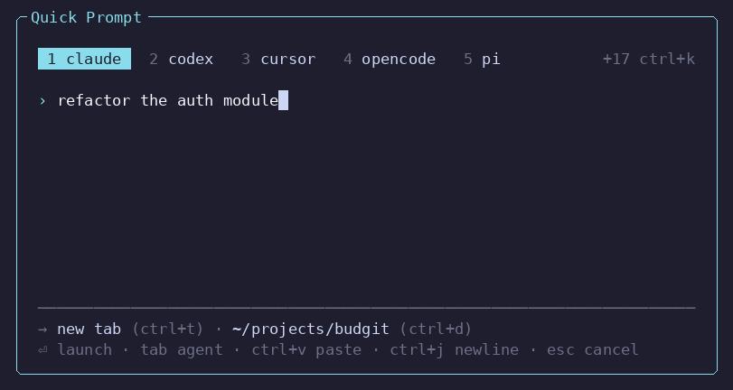
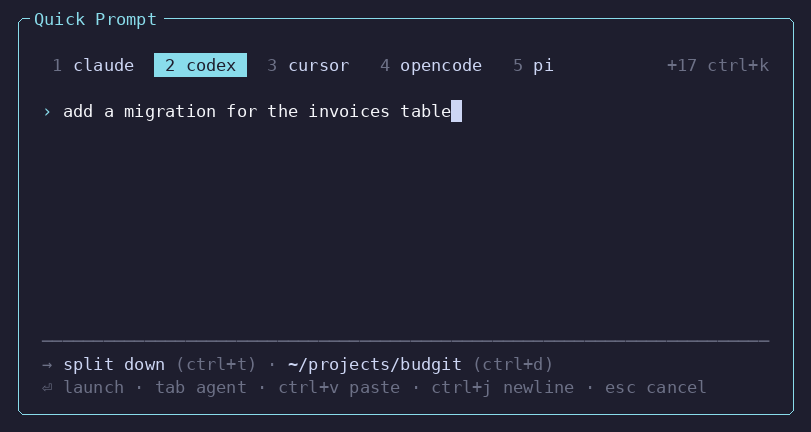
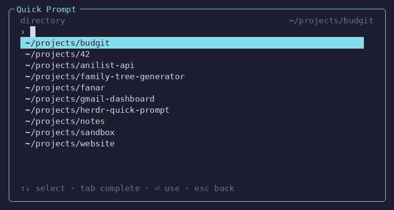
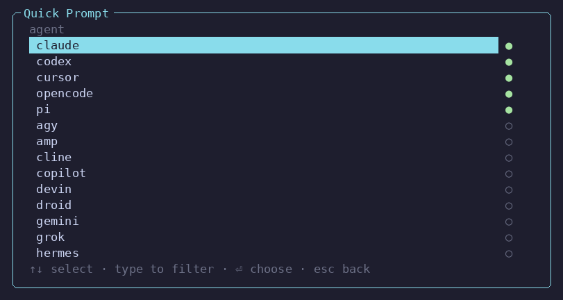

# Quick Prompt

A [Herdr](https://herdr.dev) plugin. Press a key, pick a coding agent, type a
prompt — Quick Prompt opens a new tab, starts that agent there, and hands it the
prompt.



- **One screen.** The cursor starts in the prompt; the agent is one keystroke away.
- **Numbered chips** for the agents you actually have installed. Every kind Herdr
  supports is behind `ctrl+k`.
- **New tab, a split, or a whole new workspace** — `ctrl+t` to choose, and
  `ctrl+d` to start it somewhere other than where you are.
- **The prompt lands before the TUI paints.** Agents whose CLI takes a prompt as
  an argument get it at launch instead of being typed into.
- **Pasting works** — bracketed paste, unmarked bursts, and `ctrl+v` reading your
  system clipboard.
- **No dependencies, no build step.** Just Node.

## Install

```bash
herdr plugin install Taanviir/herdr-quick-prompt
```

Requires **Node 18 or newer** on `PATH` — that is the only dependency, and there
is no build step.

Herdr plugins cannot register their own keybindings, so there is a second
action that adds one for you:

```bash
herdr plugin action invoke taanviir.quick-prompt.setup
```

It appends the binding to your `config.toml`, backs up the previous file, and
reloads Herdr. The default prefix is `ctrl+b`, so the binding is **ctrl+b** then
**shift+c**. Set `QUICK_PROMPT_KEY` to bind something else, and if the key is
already taken the action says so rather than shadowing it.

To do it by hand instead, add this to `~/.config/herdr/config.toml` and run
`herdr server reload-config`:

```toml
[[keys.command]]
key = "prefix+shift+c"
type = "plugin_action"
command = "taanviir.quick-prompt.open"
description = "Quick Prompt"
```

You can also open it without a key:

```bash
herdr plugin action invoke taanviir.quick-prompt.open
```

## Using it

Everything is on one screen, and the cursor starts in the prompt — just type and
press `enter`.

| Key | |
| --- | --- |
| `⏎` | launch (an empty prompt just opens the agent) |
| `ctrl+j` | newline in the prompt |
| `ctrl+v` | paste from the system clipboard |
| `tab` / `shift+tab` | next / previous agent |
| `alt+1`…`alt+9` | jump straight to a numbered agent |
| `ctrl+k` | the full agent list, filterable by typing |
| `ctrl+t` | destination: new tab → split right → split down → new workspace |
| `ctrl+d` | working directory: recent and neighbouring projects, or type a path |
| `esc` | cancel |

Editing keys work as you would expect, in the prompt and the directory field:

| Key | |
| --- | --- |
| `ctrl+←`/`→`, `alt+←`/`→`, `alt+b`/`alt+f` | previous / next word |
| `alt+backspace`, `ctrl+backspace`, `ctrl+w` | delete the word before the cursor |
| `alt+d`, `ctrl+delete` | delete the word after the cursor |
| `home`/`end`, `ctrl+a`/`ctrl+e` | start / end of the line |
| `ctrl+u` | clear |

On macOS, option+arrow moves by word once the terminal sends Option as Meta or
Esc (iTerm2, Terminal.app, and Ghostty all have the setting), and cmd+arrow works
wherever the terminal maps it to Home/End or `ctrl+a`/`ctrl+e`.

Up/down moves between displayed prompt lines, including wrapped lines. Long
directory paths scroll horizontally to keep the cursor visible.

If a launch fails, reopen Quick Prompt to recover the prompt, agent, directory,
and destination. Edit it and press Enter to retry, or use `ctrl+u` to clear the
text. Retrying uses the workspace and pane you open the picker from. Failed
drafts stay in the plugin state directory until replaced by a retry; successful
launch requests are removed.

The numbered chips are the agents you actually have installed, so `alt+1`–`alt+9`
always mean something. Their order is fixed on purpose — a number that points at
a different agent depending on what you ran last is worse than no number at all —
so recency only decides which chip starts selected, never where it sits.

`ctrl+t` cycles where the agent lands — a new tab, a split beside the pane you
came from, or a new workspace of its own:



`ctrl+d` changes where it starts. With nothing typed it offers the directory you
are in, the ones you have launched into before, and the projects sitting next to
this one; type to filter those, or type a path (starting with `/` or `~`) to
complete one:



A new workspace takes its name from that directory, the way Herdr names one you
open by hand.

`ctrl+k` opens every kind Herdr supports, filterable by typing, with a filled dot
against the ones installed here:



Pasting works whether or not your terminal supports it. A paste arrives as a
burst of keypresses where a newline would otherwise mean "launch" and a tab
would mean "next agent", so the picker collects the whole burst and inserts it
as text: bracketed paste when the terminal marks it, and a byte-count check when
it does not. `ctrl+v` is not a terminal paste at all — the byte reaches the
application — so the picker reads your clipboard itself through `wl-paste`,
`xclip`, `xsel`, `pbpaste`, or PowerShell on WSL and Windows.

New tabs are left unlabelled, so they get Herdr's ordinary numbering and the
agent's own live title does the describing — a label frozen from your opening
prompt stops being true the moment the work moves on. The agent itself is named
`qp-<kind>`, so you can keep driving it from scripts:

```bash
herdr agent read qp-codex --source recent-unwrapped --lines 120
```

## How it works

The picker hands off to a detached worker and exits immediately, so the modal
never sits there blocking while an agent boots.

The worker delivers the prompt one of two ways. Agents whose CLI takes a prompt
as a launch argument get it that way:

```bash
herdr agent start qp-claude --kind claude --pane <p> -- "refactor the auth module"
```

The agent has the prompt before its TUI paints, which is both faster and immune
to a startup repaint eating the keystrokes. Everything else falls back to typing
into the TUI: wait for `interactive_ready`, send, then confirm the text actually
landed before retrying. Failures surface as a Herdr notification.

Set `QUICK_PROMPT_NO_INLINE=1` to force the keystroke path, for comparing the two
when an agent misbehaves with a launch argument.

The agent list is read from `herdr agent start --help` at runtime, so new agent
kinds appear as soon as Herdr supports them. Your recent agents and last
destination live in `HERDR_PLUGIN_STATE_DIR`.

The picker renders inside the popup Herdr already draws, so it has no border or
title of its own, and it never moves its own working directory: the manifest
launches it by a path relative to the plugin root, and the directory you invoked
from travels as `QUICK_PROMPT_CWD` instead.

## Troubleshooting

Launch timings are recorded in `startup.jsonl` under `HERDR_PLUGIN_STATE_DIR`
(on Linux, normally `~/.local/state/herdr/plugins/taanviir.quick-prompt/`).
Each record includes dispatch time, individual Herdr calls, retry sleeps, and
total worker time. Prompt text and command arguments are not logged. The log
rotates after 256 KiB, retaining one previous file. `agent start` includes Herdr's
readiness detection, so its duration is not an exact measurement of first paint.

**The popup flashes and closes.** Something made the picker exit. Popup output
does not appear in `herdr plugin log list`, so the picker writes uncaught errors
to `crash.log` in its state directory:

```bash
cat "$(herdr plugin config-dir taanviir.quick-prompt | sed 's|/config/|/plugins/|')/crash.log"
# or, on Linux: ~/.local/state/herdr/plugins/taanviir.quick-prompt/crash.log
```

A crash that happens before the picker starts — a missing Node, a broken
install — leaves nothing there. Check `node --version` and
`herdr plugin list` in that case.

## Contributing

Running it from a checkout, the layout of the code, and the terminal quirks worth
knowing before you change anything: [CONTRIBUTING.md](CONTRIBUTING.md).

## Acknowledgements

The idea for this came from [NEBULA](https://github.com/agentSystemLabs/nebula)
by WebDevCody.

## License

[MIT](LICENSE).
